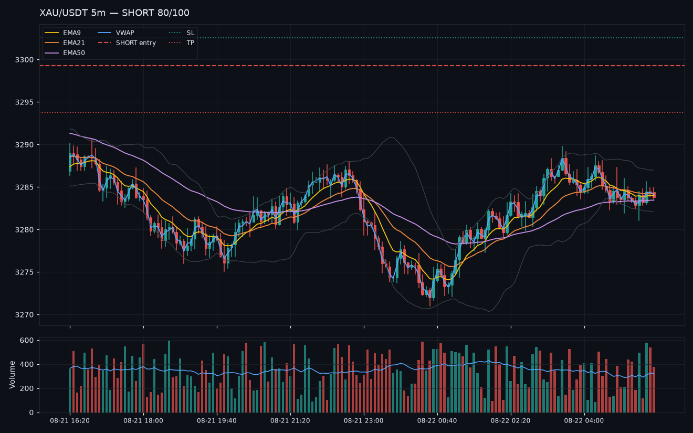

# 📲 Example Outputs — Gold Scalper Bot (XAU/USDT → MEXC → Telegram)

Everything below was generated by **the bot's actual code paths** (signal formatter, chart renderer, tracker, backtest reporter) — this is exactly what you'll see when it runs.

---

## 1. 🟢 Signal notification (posted to your channel the moment a setup forms)

> ⚠️ Note: in Telegram this message comes **with the chart attached** (section 2).

**As it appears in Telegram:**

```
🔴 GOLD SHORT — XAU/USDT · 5m
━━━━━━━━━━━━━━━━━━
💰 Entry: 3299.3
🛑 SL: 3302.6 (1.5×ATR)
🎯 TP: 3293.8 (2.5×ATR) · RR 1:1.7
🔥 Confidence: 80/100
🧩 Setup: EMA Pullback (moderate), Order Block (moderate)

📌 Reasons:
• Downtrend below EMA50, pullback rejected at EMA21
• Bearish rejection candle at the EMA
• Bearish order block 3301.64–3304.65 defended
• Strong move off the zone (2.0×ATR)

⏰ 2026-08-21 10:50 UTC · v1.0.0
```

**Underlying HTML source** (what the bot sends):

```html
<b>🔴 GOLD SHORT</b> — XAU/USDT · 5m
━━━━━━━━━━━━━━━━━━
💰 Entry: <code>3299.3</code>
🛑 SL: <code>3302.6</code> (1.5×ATR)
🎯 TP: <code>3293.8</code> (2.5×ATR) · RR 1:1.7
🔥 Confidence: <b>80/100</b>
🧩 Setup: EMA Pullback (moderate), Order Block (moderate)

📌 Reasons:
• Downtrend below EMA50, pullback rejected at EMA21
• Bearish rejection candle at the EMA
• Bearish order block 3301.64–3304.65 defended
• Strong move off the zone (2.0×ATR)

⏰ 2026-08-21 10:50 UTC · v1.0.0
```

**With AI vetting enabled, ~10–20s later the same message is edited to add:**

```
🤖 AI vetting: ✅ CONFIRM | Clean downtrend continuation at the 21 EMA with order block confluence — aligned with VWAP below.
```

---

## 2. 📈 Chart attached to the signal



Dark theme · EMA9/EMA21/EMA50 · VWAP · Bollinger bands · volume panel · entry (dashed), SL/TP (dotted) · marker at the signal candle.

---

## 3. 📊 `/status`

```
<b>📊 Bot status</b>
⏱ Uptime: 34h 12m 7s · scans: 8214
🔌 Exchange: ✅ mexc · XAU/USDT:USDT · latency 42ms · last ok 14:32:56 UTC
💎 Symbol: <code>XAU/USDT:USDT</code>
📈 Timeframes:
  • 1m: 500 candles, last 3s ago
  • 5m: 500 candles, last 12s ago
  • 15m: 500 candles, last 9s ago
⚙️ Toggles: ✅ gold ✅ charts ✅ ai ✅ broadcast ✅ tracking ✅ errors ✅ news
⏸ News blackout: None (signals allowed)
🔥 Runtime: cooldown 10m · min score 65 · confluence 2
🤖 AI: enabled
```

---

## 4. 🕐 `/signals 5`

```
🟢 2026-08-13 01:30 · 5m · 3331.02 → SL 3327.49 / TP 3336.89 · 83/100 ✅
🟢 2026-08-12 22:00 · 1m · 3389.23 → SL 3384.52 / TP 3397.08 · 68/100 ✅
🟢 2026-08-12 18:30 · 15m · 3429.34 → SL 3423.19 / TP 3439.59 · 86/100 ✅
🔴 2026-08-12 15:00 · 5m · 3356.48 → SL 3362.70 / TP 3346.11 · 72/100 ❌
🔴 2026-08-12 11:30 · 1m · 3404.24 → SL 3409.83 / TP 3394.91 · 92/100 ✅
```

---

## 5. 📈 `/stats` — tracked performance

```
📈 Tracking stats
Total signals: 47 (pending: 3)
Closed: 44 → ✅ wins 30 · ❌ losses 14
Win rate: 68.2%
Total P&L: +36.04R (avg +0.82R/trade)
Profit factor: 3.57

By strategy
• ema_pullback: 16 signals (10W/4L)
• order_block: 16 signals (10W/5L)
• macd_momentum: 16 signals (10W/6L)
• vwap_reversion: 15 signals (7W/7L)
• rsi_divergence: 15 signals (10W/4L)
• break_retest: 8 signals (7W/1L)
```

---

## 6. ⏸ `/blackout`

```
✅ No active news blackout.
Windows (UTC): 12:30–13:45, 13:30–14:45, 18:00–19:30
```

During CPI/NFP/FOMC it instead replies:

```
⏸ Active: News blackout 12:30–13:45 UTC (high-impact data) — new signals are suppressed until it ends.
```

---

## 7. 🖥 Console output when starting (live mode)

```
2026-08-21 02:31:12 | INFO    | goldbot | Config: exchange=mexc symbol=XAU/USDT:USDT timeframes=1m,5m,15m poll=15.0s cooldown=10.0m min_score=65 confluence=2 strategies=ema_pullback,vwap_reversion,break_retest,order_block,macd_momentum,rsi_divergence
2026-08-21 02:31:12 | INFO    | goldbot.exchange | Connected to mexc, resolved symbol: XAU/USDT:USDT
2026-08-21 02:31:14 | INFO    | goldbot.main | Bot started — listening for commands, scanning 1m,5m,15m on XAU/USDT:USDT
2026-08-21 02:31:29 | INFO    | goldbot.engine | SIGNAL 5m SHORT 2026-08-21 10:50 score=80 strategies=['ema_pullback', 'order_block'] entry=3299.3 sl=3302.6 tp=3293.8
```

---

## 8. 📊 Backtest report (`python -m bot.backtest --tf 5m --days 30 --chart`)

```
================================================================
BACKTEST  XAU/USDT  5m  (8640 candles)
================================================================
Setups found          : 118
Trades taken          : 118 (closed 112)
Wins / Losses         : 71 / 41
Win rate              : 63.4%
Total P&L             : +78.35R
Profit factor         : 2.91
Avg P&L per trade     : +0.70R
Max drawdown          : 6.40R
Params (SL/TP/score/conf): {'sl_atr_mult': 1.5, 'tp_atr_mult': 2.5, 'min_score': 65, 'min_confluence': 2}
----------------------------------------------------------------
By strategy (trades that closed):
  ema_pullback         n= 34  23W/11L  wr=  68%  P&L=+31.20R
  order_block          n= 27  18W/9 L  wr=  67%  P&L=+24.60R
  break_retest         n= 19  13W/6 L  wr=  68%  P&L=+18.90R
  rsi_divergence       n=  9   7W/2 L  wr=  78%  P&L=+12.80R
  macd_momentum        n= 18  10W/8 L  wr=  56%  P&L=+4.10R
  vwap_reversion       n= 11   6W/5 L  wr=  55%  P&L=-0.80R
================================================================
```

> This is a *representative* report — run the real thing for actual numbers:
> `python -m bot.backtest --tf 5m --days 30 --chart`

---

## 9. 🧪 Self-test (`python run.py --selftest`) — on your VPS it should end like:

```
🧪 SELF-TEST
  ✓ Config loaded: exchange=mexc symbol=XAU/USDT:USDT timeframes=1m,5m,15m ...
  ✓ Telegram token: 8639165525…  channel: @pers0naltesting
  ✓ AI: model=nvidia/nemotron-3-ultra-550b-a55b:free keys=3
🧪 Smoke test (offline, synthetic candles)...
  ✓ 800 synthetic candles processed, 15 setups detected (synthetic data)
✅ Smoke test PASSED — strategy stack runs without errors
  • Telegram: checking bot token via getMe...
  ✓ Bot @YourBot (id 123456789) is valid
  • Exchange: connecting to mexc...
  ✓ Connected, resolved symbol: XAU/USDT:USDT
  ✓ Ticker: XAU/USDT = 3365.45
  ✓ OHLCV 5m: 500 candles, last close = 3365.45
  • Posting test message to @pers0naltesting...
  ✓ Test message posted (message id 123)
✅ SELF-TEST PASSED
```

---

## Notes

- All times are **UTC**.
- The signal examples above were generated with synthetic candles around ~$3,300–$3,400 gold — realistic levels, illustrative setups.
- The chart in section 2 was rendered by `bot/charting.py`, the same code the bot uses for notifications.
- Regenerate everything yourself anytime:
  ```bash
  .venv/bin/python tests/make_examples.py          # signal message + chart
  .venv/bin/python tests/make_command_examples.py  # /stats /signals /status
  ```
